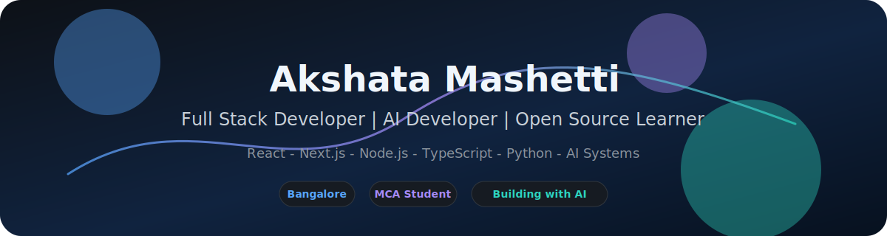

  <picture>
    <source media="(prefers-color-scheme: dark)" srcset="./assets/dark.svg" />
    <source media="(prefers-color-scheme: light)" srcset="./assets/light.svg" />
    
  </picture>

<h1 align="center">Hi 👋 I’m Akshata Mashetti</h1>

  <b>Full Stack Developer</b> • <b>AI Developer</b> • <b>Open Source Learner</b>

  
  

---

## ✨ About Me

I’m <b>Akshata Mashetti</b>, currently pursuing <b>MCA (2026–2028)</b> at <b>RV College of Engineering, Bangalore</b>. I build modern full-stack web apps, ship AI-powered features, and learn by contributing to open source.

- 📍 <b>Location:</b> Bangalore, India
- 🎓 <b>Education:</b> MCA (2026–2028), RVCE Bangalore
- 🧠 <b>Focus:</b> React, Next.js, Node.js, AI systems

---

## 🧰 Tech Stack

| Category | Technologies |
|---|---|
| Frontend | React, Next.js, Tailwind CSS |
| Backend | Node.js, Express.js |
| Databases | MongoDB, PostgreSQL |
| ORM | Prisma |
| Languages | TypeScript, JavaScript, Python, Java, C++ |
| DevOps | Docker, REST APIs |
| Collaboration | Git, GitHub |

---

## 📈 GitHub Insights

  
  

  

  

---

## 🐍 Contribution Trail

  <picture>
    <source media="(prefers-color-scheme: dark)" srcset="https://raw.githubusercontent.com/Akshataprajwal/Akshataprajwal/output/github-contribution-grid-snake-dark.svg" />
    <source media="(prefers-color-scheme: light)" srcset="https://raw.githubusercontent.com/Akshataprajwal/Akshataprajwal/output/github-contribution-grid-snake.svg" />
    
  </picture>

---

## 🏆 GitHub Trophies

  

---

## 👁️ Visitor Counter

  

---

## ⭐ Featured Projects

  
  &nbsp;
  
  &nbsp;
  

### 1. Cognify AI

AI-powered full stack web application generator.

### 2. EduVerse

Learning Management Platform designed for scalable education experiences.

### 3. Prescripto

Doctor appointment and hospital management platform.

---

## 🏅 Achievements & Highlights

- Built full-stack projects with production-style tooling
- Implemented AI features in real application flows
- Consistent learning through open source contributions

---

## 📜 Certifications

- Add certifications here when available

---

## 📄 Resume

  

---

## 🌐 Connect

  
  &nbsp;
  

---

## 🤝 Contact & Support

  Open to collaborating on AI and full-stack projects.

---

  Built with ❤️ by Akshata Mashetti • Bangalore, India

